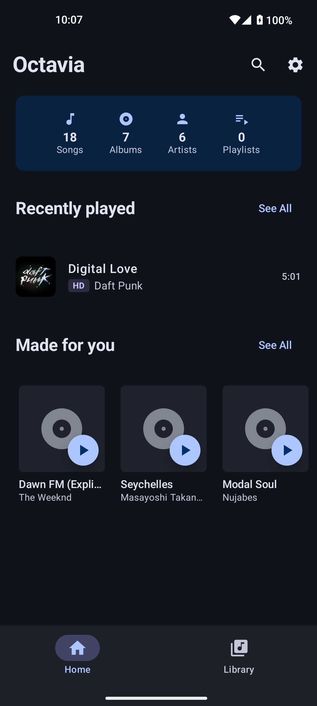
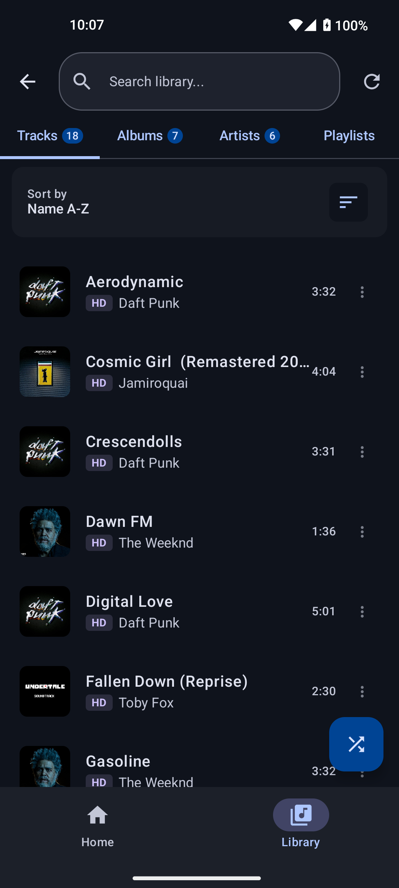
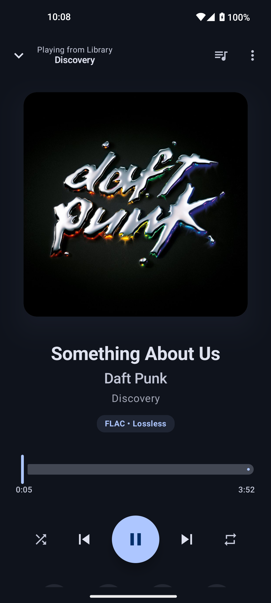

# Octavia

A modern, offline-first Android music player engineered for high-fidelity audio playback. Built with Kotlin, Jetpack Compose, and Media3 ExoPlayer, supporting lossless formats up to 192kHz/32-bit.

[](https://kotlinlang.org)
[](https://developer.android.com/jetpack/compose)
[](https://developer.android.com/about/versions/nougat)

## Screenshots

<p align="center">
  
  
  
</p>

## Features

### Audio Capabilities
- **Hi-Res Audio Support**: FLAC, ALAC, WAV up to 192kHz/32-bit with gapless playback
- **Custom Audio Pipeline**: Optimized ExoPlayer configuration with float output for enhanced quality
- **Background Playback**: Full MediaSession integration with notification controls

### Library Management
- **Smart Organization**: Automatic grouping by Albums, Artists, and Playlists with grid layouts
- **Advanced Scanning**: MediaStore-based library scanning with background artwork extraction
- **Full-Text Search**: Fast search across all media with Room FTS integration
- **Queue Management**: Context-aware track selection with shuffle and repeat modes

### User Interface
- **Material 3 Design**: Dynamic color theming with edge-to-edge display
- **Responsive Layouts**: Adaptive grid views for albums (square), artists (circular), and playlists
- **Real-time Updates**: Live progress tracking with optimized StateFlow combining 7+ data streams

## Architecture

Built with Clean Architecture principles and MVVM pattern:

```
app/src/main/java/com/octavia/player/
├── data/              # Database, repositories, media scanner
├── domain/            # Use cases and repository interfaces
├── presentation/      # Compose UI, ViewModels, navigation
└── di/                # Hilt dependency injection modules
```

### Tech Stack

- **Language**: Kotlin 2.2.20 with Coroutines & Flow
- **UI**: Jetpack Compose with Material 3
- **Architecture**: MVVM + Clean Architecture + Repository Pattern
- **Dependency Injection**: Hilt
- **Database**: Room with TypeConverters and full-text search
- **Media**: Media3 ExoPlayer with MediaSessionService
- **Background Tasks**: WorkManager with Hilt integration
- **Testing**: JUnit 4/5, MockK, Turbine

### Key Implementations

- **Reactive State Management**: Combines multiple StateFlows for unified UI state
- **Optimized Playback**: Self-rescheduling Runnable pattern for smooth position updates
- **Efficient Caching**: Background artwork extraction with progress tracking
- **Type-Safe Navigation**: Hilt-integrated Navigation Compose

## Getting Started

### Prerequisites
- Android Studio Hedgehog (2023.1.1) or later
- JDK 17 or higher
- Android SDK API 24 minimum

### Build

```bash
# Build and install
./gradlew assembleDebug
./gradlew installDebug

# Testing
./gradlew test                 # Run unit tests
./gradlew detekt lint         # Code quality checks
```

## Supported Formats

| Format        | Sample Rate   | Bit Depth | Type         |
|---------------|---------------|-----------|--------------|
| FLAC          | up to 192 kHz | 32-bit    | Lossless     |
| ALAC          | up to 192 kHz | 32-bit    | Lossless     |
| WAV           | up to 192 kHz | 32-bit    | Uncompressed |
| MP3, AAC, OGG | up to 48 kHz  | 16-bit    | Lossy        |

## Contributing

Contributions are welcome. Please follow these guidelines:

1. Fork the repository and create a feature branch
2. Follow Kotlin coding conventions and existing architecture patterns
3. Write unit tests for new features
4. Run code quality checks before submitting: `./gradlew detekt lint test`
5. Submit a pull request with a clear description

### Areas for Contribution
- Equalizer and audio effects implementation
- Android Auto integration
- Lyrics display and synchronization
- Performance optimizations and test coverage expansion

## License

This project is licensed under the GPL-3.0 License - see the [LICENSE](LICENSE) file for details.

## Acknowledgments

Built with Media3, Jetpack Compose, and Material Design 3 components from the Android Open Source Project.
